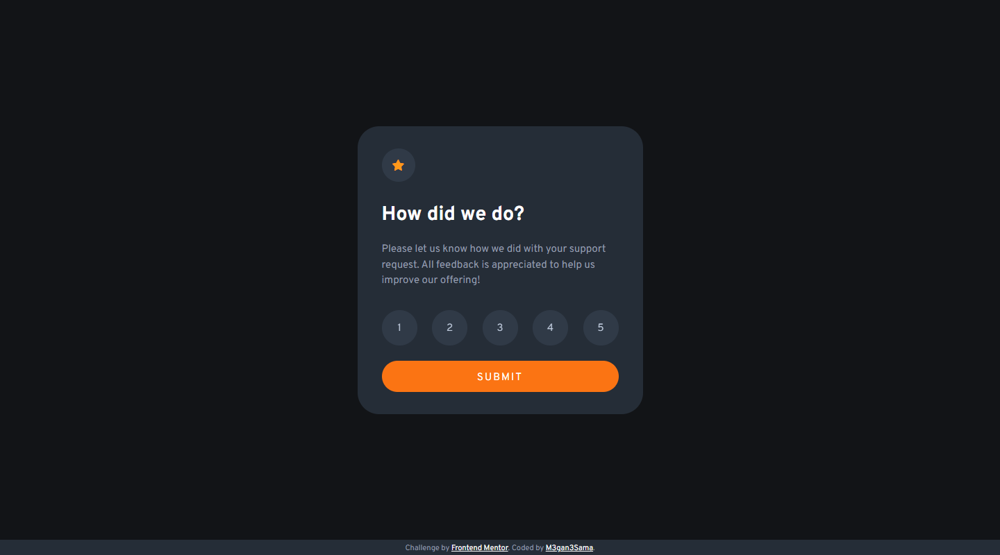

# Frontend Mentor - Interactive rating component

This is a solution to the [Interactive rating component challenge on Frontend Mentor](https://www.frontendmentor.io/challenges/interactive-rating-component-koxpeBUmI).

## Welcome! 👋

Thanks for checking My solution for this challenge!

### The challenge

This challenge uses javaScript to show rating in a new card.

### Screenshot

#### Desktop preview:

  

---

#### Mobile preview:

  

---

  

---

### Links

- Solution URL: [You can find My solution here](https://github.com/M3gan3Sama/interactive-rating-component-main.git)
- Live Site URL: [This is my Live site for This challenge](https://m3gan3sama.github.io/interactive-rating-component-main/)

## My process

### Built with

- Semantic HTML5 markup
- CSS
- CSS Grid
- Flexbox
- Vanilla JavaScript
- Media query

## Table of contents

- [Frontend Mentor - Interactive rating component](#frontend-mentor---interactive-rating-component)
  - [Welcome! 👋](#welcome-)
    - [The challenge](#the-challenge)
    - [Screenshot](#screenshot)
      - [Desktop preview:](#desktop-preview)
      - [Mobile preview:](#mobile-preview)
    - [Links](#links)
  - [My process](#my-process)
    - [Built with](#built-with)
  - [Table of contents](#table-of-contents)